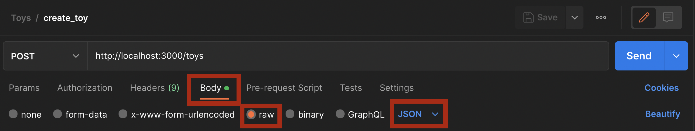
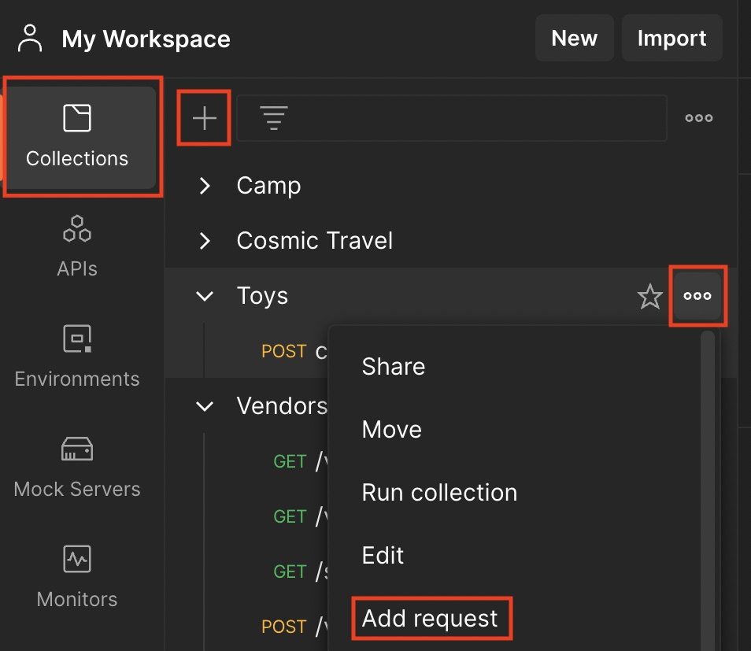

# Mini-lecture: How to use Postman to test your routes

## Goals:
- Be able to access backend data with GET requests in Postman
- Be able to add and change data with POST and PATCH requests
- Be able to diagnose and fix common errors
  - server not running
  - no route matches X
  - no method error
- Be able to organize your Postman requests into collections for easy access

## Review: Rails Routing and Browser Requests
- What does a Rails route do? What layer of MVC does it occupy?
- Which files are the key players in setting up a Rails route?
- How do you set up a route in Rails?
- How can you use your browser to test that your server is running and has the correct data?

## Why Postman?
- You can use browser to test GET requests (index and show)
- But you can't test POST, PATCH, or DELETE requests (create, update, and destroy, respectively) without a functioning front end
- Postman is a tool that lets you do that

## Key tips
- configure your request as Body > raw > JSON, like so:

- save your requests to access them later 
  - Collections > New Collection > New Request
